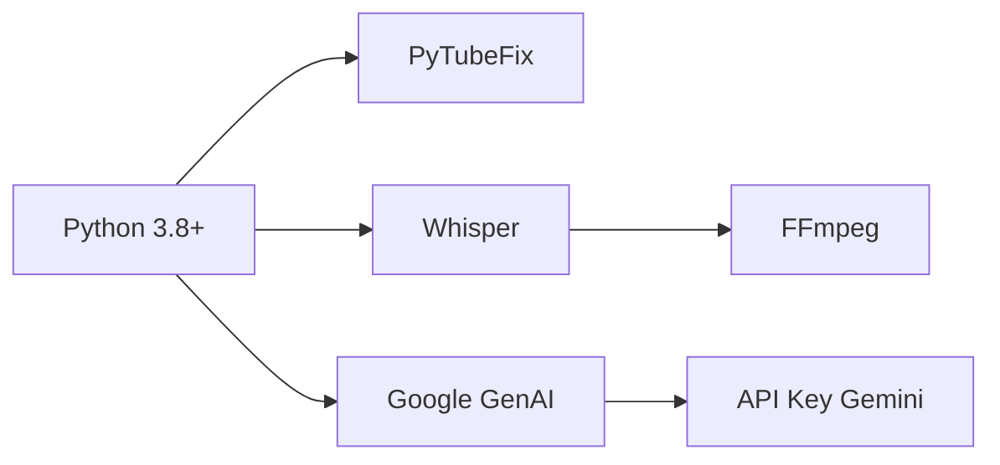

# 📚 Documentação do Sonarize

**Versão:** 1.0.0  
**Última atualização:** Fevereiro/2026  
**Autor:** Davi Bezerra Fraga  

---

## 📑 Sumário

1. [Visão Geral](#-visão-geral)
2. [Arquitetura do Sistema](#-arquitetura-do-sistema)
3. [Instalação e Configuração](#-instalação-e-configuração)
4. [Guia de Uso](#-guia-de-uso)
5. [Estrutura de Arquivos](#-estrutura-de-arquivos)
6. [API Reference](#-api-reference)
7. [Solução de Problemas](#-solução-de-problemas)
8. [Perguntas Frequentes](#-perguntas-frequentes)
9. [Contribuição](#-contribuição)
10. [Referências](#-referências)

---

## 🎯 Visão Geral

O **Sonarize** é uma ferramenta de inteligência de áudio que automatiza o processo de extração de conhecimento de vídeos do YouTube. O sistema realiza download do áudio, transcrição com Whisper da OpenAI e resumo inteligente com Google Gemini.

### ✨ Principais Funcionalidades

| Funcionalidade | Descrição |
|----------------|-----------|
| 📥 **Download** | Extrai áudio de vídeos do YouTube em formato M4A |
| 📝 **Transcrição** | Converte áudio em texto usando Whisper (modelo 'base') |
| 🧠 **Resumo Inteligente** | Gera resumos concisos via Google Gemini |
| 📄 **Exportação** | Salva transcrição completa em arquivo .txt |
| 🇧🇷 **Português** | Otimizado para conteúdo em português |

### 🔄 Fluxo de Processamento

```
URL do YouTube → Download Áudio → Transcrição Whisper → Resumo Gemini → Resultado
         ↓                ↓                  ↓                  ↓
    Input usuário    audioyt.m4a      transcricao.txt    Resumo na tela
```

---

## 🏗️ Arquitetura do Sistema

### Diagrama de Componentes

```
┌─────────────────┐
│   PyTubeFix     │  ← Download de áudio do YouTube
└────────┬────────┘
         ↓
┌─────────────────┐
│  audioyt.m4a    │  ← Arquivo de áudio temporário
└────────┬────────┘
         ↓
┌─────────────────┐
│    Whisper      │  ← Transcrição (modelo 'base', pt)
└────────┬────────┘
         ↓
┌─────────────────┐
│ transcricao.txt │  ← Texto completo
└────────┬────────┘
         ↓
┌─────────────────┐
│    Gemini       │  ← Geração de resumo (Flash Lite)
└────────┬────────┘
         ↓
┌─────────────────┐
│   Resumo Final  │  ← Saída para o usuário
└─────────────────┘
```

### Dependências do Sistema



---

## 🔧 Instalação e Configuração

### 1. Requisitos de Sistema

| Componente | Versão Mínima | Recomendado |
|------------|---------------|--------------|
| Python | 3.8 | 3.11+ |
| FFmpeg | 4.0 | 6.0+ |
| RAM | 4GB | 8GB |
| Disco | 500MB | 2GB |


### 2. Instalação do FFmpeg

**Windows:**
```bash
# Usando Chocolatey
choco install ffmpeg

# Ou baixe manualmente de ffmpeg.org
```

**Linux (Ubuntu/Debian):**
```bash
sudo apt update
sudo apt install ffmpeg
```

**macOS:**
```bash
brew install ffmpeg
```

### 3. Configuração do Ambiente Python

```bash
# Criar ambiente virtual (recomendado)
python -m venv venv

# Ativar ambiente
# Windows:
venv\Scripts\activate
# Linux/macOS:
source venv/bin/activate

# Instalar dependências
pip install pytubefix openai-whisper google-generativeai
```

### 4. Arquivo requirements.txt

```txt
pytubefix==6.14.0
openai-whisper==20240930
google-generativeai==0.7.0
torch==2.4.0  # Dependência do Whisper
```

### 5. Obter API Key do Gemini

1. Acesse [Google AI Studio](https://makersuite.google.com/app/apikey)
2. Faça login com sua conta Google
3. Clique em "Create API Key"
4. Copie a chave gerada
5. Substitua no código: `api_key="SUA_API_KEY_AQUI"`

### 6 .🎙️ Modelos e Idiomas Disponíveis
Modelos Whisper
O Whisper oferece diferentes tamanhos de modelo, cada um com equilíbrio entre velocidade e precisão. Para uso em português, recomendamos os modelos multilíngues (sem sufixo .en).

| Tamanho | Parâmetros |       Modelo       | VRAM Necessária | Velocidade Relativa |           Ideal para           |
|:-------:|:----------:|:------------------:|:---------------:|:-------------------:|:------------------------------:|
|  tiny   |    39 M    |       `tiny`       |      ~1 GB      |         ~10x        | Testes rápidos, baixa precisão |
|  base   |    74 M    |       `base`       |      ~1 GB      |         ~7x         | Uso geral, bom equilíbrio      |
| small   |   244 M    |      `small`       |      ~2 GB      |         ~4x         | Maior precisão, ainda rápido   |
| medium  |   769 M    |      `medium`      |      ~5 GB      |         ~2x         | Alta precisão                  |
| large   |   1550 M   |      `large`       |     ~10 GB      |          1x         | Máxima precisão                |
| turbo   |   809 M    |      `turbo`       |      ~6 GB      |         ~8x         | Otimizado, rápido e preciso    |

---

## 📖 Guia de Uso

### Execução no Google Colab (Recomendado)

1. **Acesse** [Google Colab](https://colab.research.google.com)
2. **Crie** um novo notebook
3. **Cole** o código do Sonarize
4. **Execute** célula por célula

### Execução Local (Jupyter Notebook)

```bash
# Instalar Jupyter
pip install jupyter

# Iniciar notebook
jupyter notebook

# Abrir Sonarize.ipynb
# Executar células sequencialmente
```

### Passo a Passo Detalhado

#### **Célula 1: Download do Áudio**
```python
# O programa solicitará a URL
url = input("Digite a url do youtube: ")

# Exemplo de entrada:
# Digite a url do youtube: https://youtu.be/abcdef12345

# Saída esperada:
# Título do vídeo: "Aula de Python para Iniciantes"
# [download progress...]
# Arquivo salvo: audioyt.m4a
```

#### **Célula 2: Transcrição com Whisper**
```python
# Processamento automático
# Tempo: ~1-5 minutos dependendo da duração
# Arquivo gerado: transcricao.txt
```

#### **Célula 3: Resumo com Gemini**
```python
# Geração do resumo
# Tempo: ~2-10 segundos
# Saída: Resumo inteligente exibido na tela
```

### 📝 Exemplo Prático

**Entrada:**
```
URL: https://youtu.be/_uQrJ0TkZlc (Python para iniciantes - 30min)
```

**Processamento:**
```python
# Transcrição gerada (trecho)
"Olá pessoal, sejam bem-vindos a mais uma aula de Python...
Hoje vamos aprender sobre variáveis, tipos de dados e estruturas de controle..."

# Gemini processa e retorna:
```

**Resumo Gerado:**
```
📌 RESUMO DO VÍDEO:

Nesta aula de 30 minutos sobre Python para iniciantes, foram abordados:

• Conceitos básicos de variáveis e tipos de dados (int, float, string, boolean)
• Estruturas condicionais (if, elif, else) com exemplos práticos
• Laços de repetição (for e while) para iterações
• Dicas de boas práticas para iniciantes
• Exercícios propostos para fixação do conteúdo

O instrutor utiliza exemplos simples e didáticos, ideal para quem está 
começando na programação.
```

---

## 📂 Estrutura de Arquivos

### Diretório do Projeto

```
sonarize/
│
├── sonarize.ipynb          # Notebook principal
├── requirements.txt         # Dependências do projeto
├── LICENSE                  # Licença MIT
├── README.md                # Documentação resumida
│
├── audioyt.m4a             # Áudio baixado (gerado)
├── transcricao.txt          # Transcrição completa (gerado)
│
└── docs/                    # Documentação adicional 
    └── manual.md
```

### Arquivos Gerados

| Arquivo | Formato | Tamanho Médio | Descrição |
|---------|---------|---------------|-----------|
| `audioyt.m4a` | M4A | 5-50 MB | Áudio do YouTube |
| `transcricao.txt` | TXT | 10-100 KB | Transcrição completa |

**Observação:** Os arquivos são sobrescritos a cada execução.

---

## 🔌 API Reference

### PyTubeFix - Download de Áudio

```python
from pytubefix import YouTube

# Inicialização
yt = YouTube(url, on_progress_callback=on_progress)

# Propriedades úteis
print(yt.title)           # Título do vídeo
print(yt.length)          # Duração em segundos
print(yt.author)          # Canal/autor

# Download
ys = yt.streams.get_audio_only()
ys.download(filename="audioyt.m4a")
```

### Whisper - Transcrição

```python
import whisper

# Carregar modelo
modelo = whisper.load_model("base")
# Opções: tiny, base, small, medium, large

# Transcrever
resultado = modelo.transcribe(
    "audioyt.m4a",
    fp16=False,        # Desabilitar FP16 (compatibilidade)
    language="pt"      # Forçar português
)

# Acessar resultados
texto = resultado["text"]
segmentos = resultado["segments"]  # Timestamps
```

### Google Gemini - Resumo

```python
from google import genai

# Cliente
client = genai.Client(api_key="SUA_API_KEY")

# Gerar conteúdo
response = client.models.generate_content(
    model='gemini-flash-lite-latest',
    contents="Faça um resumo breve do conteúdo: " + transcricao
)

# Resposta
resumo = response.text
```

---

## 🐛 Solução de Problemas

### Erros Comuns e Soluções

#### 1. **Erro: "pytubefix.exceptions.VideoUnavailable"**

**Causa:** Vídeo privado, removido ou com restrição geográfica  
**Solução:** 
- Verifique se o vídeo está público
- Tente outra URL
- Verifique restrições de idade

#### 2. **Erro: "FFmpeg not found"**

**Causa:** FFmpeg não instalado ou não no PATH  
**Solução:**
```bash
# Verificar instalação
ffmpeg -version

# Se não encontrado, instalar (ver seção de instalação)
# Ou especificar caminho manualmente
```

#### 3. **Erro: "CUDA out of memory"**

**Causa:** GPU sem memória suficiente para Whisper  
**Solução:**
```python
# Forçar CPU em vez de GPU
resultado = modelo.transcribe(
    "audioyt.m4a", 
    fp16=False,
    language="pt"
)
# Ou usar modelo menor (tiny/base)
```

#### 4. **Erro: "API key not valid"**

**Causa:** Chave Gemini inválida ou expirada  
**Solução:**
- Gere nova chave no Google AI Studio
- Verifique se copiou corretamente
- Remova espaços extras

#### 5. **Erro: "Model not found"**

**Causa:** Nome do modelo incorreto  
**Solução:** 
```python
# Modelos válidos em 2025-2026:
model='gemini-flash-lite-latest'
model='gemini-1.5-flash-latest'
model='gemini-1.5-pro-latest'
```

### Logs de Debug

Para diagnóstico, adicione:

```python
import logging
logging.basicConfig(level=logging.INFO)

# Whisper com verbose
resultado = modelo.transcribe(..., verbose=True)
```

---

## ❓ Perguntas Frequentes

### **P: Posso usar outros formatos de áudio além do YouTube?**
**R:** Na versão atual, apenas YouTube. Futuras versões suportarão MP3, WAV e outros.

### **P: Quanto tempo leva para processar um vídeo de 1 hora?**
**R:** 
- Download: 1-5 min (depende da internet)
- Transcrição: 10-20 min (modelo base)
- Resumo: 5-10 segundos  
**Total estimado:** 15-30 minutos

### **P: Preciso de GPU para rodar?**
**R:** Não, o modelo 'base' do Whisper roda bem em CPU. GPU acelera, mas não é obrigatória.

### **P: O resumo é sempre em português?**
**R:** O resumo será no mesmo idioma do vídeo. Se o vídeo for em inglês, o resumo virá em inglês.

### **P: Posso processar vídeos muito longos?**
**R:** Sim, mas há limites:
- Whisper: aceita até ~12h de áudio
- Gemini: limite de contexto (~1M tokens = ~3h de fala)
- **Recomendação:** vídeos até 2-3h

### **P: O Gemini tem custo?**
**R:** O modelo `gemini-flash-lite` é **gratuito** com limites generosos:
- 60 requisições por minuto
- 1500 requisições por dia

### **P: Como melhorar a precisão da transcrição?**
**R:**
1. Use modelo maior: `large` (mais preciso, mais lento)
2. Garanta áudio de qualidade (evite ruídos)
3. Especifique o idioma: `language="pt"`

---

## 🤝 Contribuição

### Como Contribuir

1. **Fork** o repositório
2. **Crie** uma branch: `git checkout -b feature/nova-funcionalidade`
3. **Commit** suas mudanças: `git commit -m 'Adiciona nova funcionalidade'`
4. **Push** para a branch: `git push origin feature/nova-funcionalidade`
5. **Abra** um Pull Request

### Diretrizes de Código

- Siga PEP 8 para Python
- Adicione comentários em código complexo
- Atualize documentação quando necessário
- Teste antes de enviar PR

### Reportando Bugs

Use [GitHub Issues](https://github.com/Davibzf/sonarize/issues) com:

- Descrição do problema
- Passos para reproduzir
- Logs de erro (se houver)
- Ambiente (SO, versões)

---

## 📚 Referências

### Documentações Oficiais

- [PyTubeFix Documentation](https://pytubefix.github.io/)
- [OpenAI Whisper GitHub](https://github.com/openai/whisper)
- [Google Gemini API Docs](https://ai.google.dev/docs)
- [FFmpeg Documentation](https://ffmpeg.org/documentation.html)

### Tutoriais e Artigos

- [Whisper: Tutorial de Transcrição](https://github.com/openai/whisper/discussions)
- [Gemini: Primeiros Passos](https://ai.google.dev/tutorials)
- [PyTubeFix: Como baixar áudio do YouTube](https://pytubefix.readthedocs.io/)

### Comunidades

- [r/MachineLearning](https://reddit.com/r/MachineLearning)
- [Stack Overflow - Python](https://stackoverflow.com/questions/tagged/python)
- [Discord do Google AI](https://discord.gg/googleaistudio)

---

## 📌 Changelog

### v1.0.0 (Fevereiro/2026)
- ✅ Download de áudio do YouTube
- ✅ Transcrição com Whisper (modelo base)
- ✅ Resumo com Gemini Flash Lite
- ✅ Suporte a português
- ✅ Documentação completa

### Próximas versões
- 🚧 Suporte a arquivos locais
- 🚧 Interface web
- 🚧 Processamento em lote
- 🚧 Múltiplos idiomas

---

## 📞 Suporte

**Autor:** Davi Bezerra Fraga

- **GitHub:** [@Davibzf](https://github.com/Davibzf)
- **LinkedIn:** [Davi Bezerra Fraga](https://www.linkedin.com/in/davi-bezerra-fraga-319a49363/)
- **Email:** davibezerrafraga@gmail.com
- **Portfólio:** [davibezerrafraga.vercel.app](https://davibezerrafraga.vercel.app)

---

## ⚖️ Licença

Este projeto está licenciado sob a **MIT License** - veja o arquivo [LICENSE](LICENSE) para detalhes.

Copyright © 2026 Davi Bezerra Fraga

---

> 🌟 **Sonarize: Mergulhe fundo no seu áudio, emergia com respostas.**  
> *Documentação gerada em 16 de fevereiro de 2026*

---
